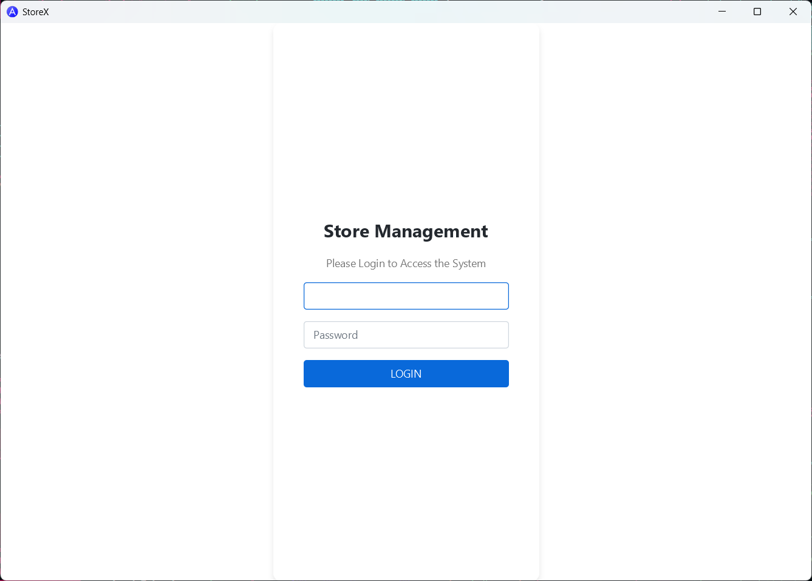
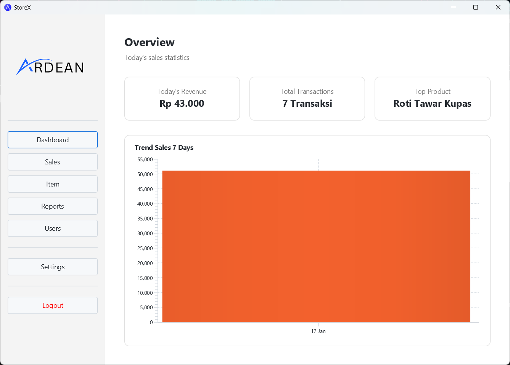
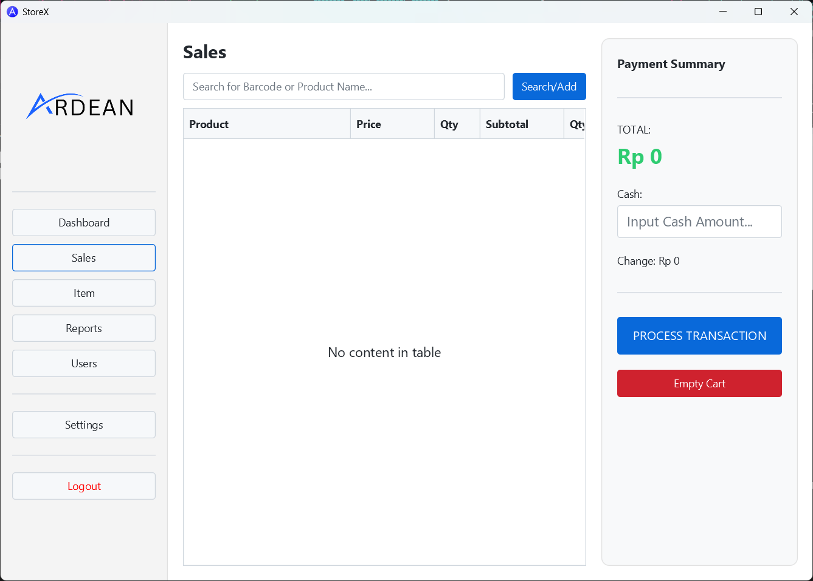
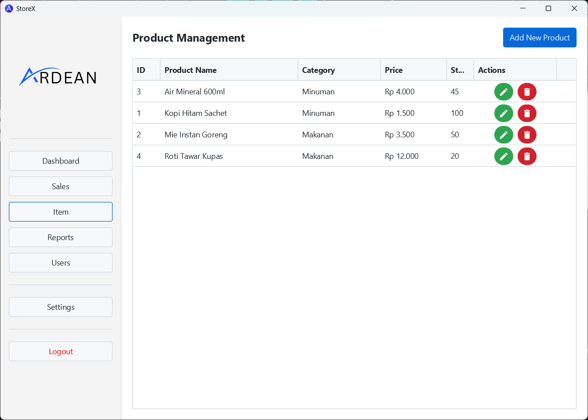
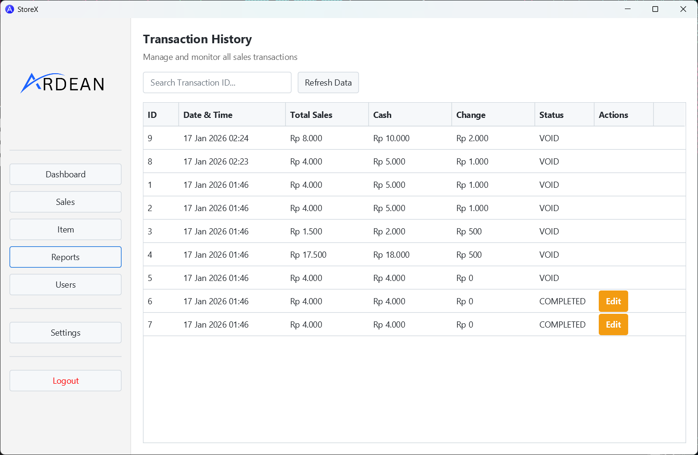
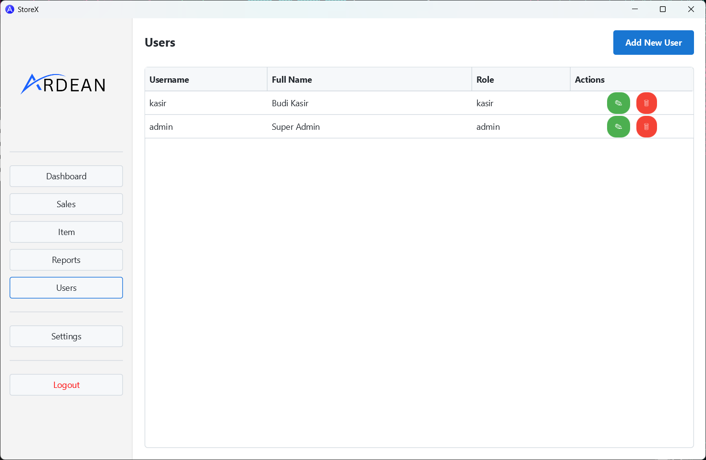
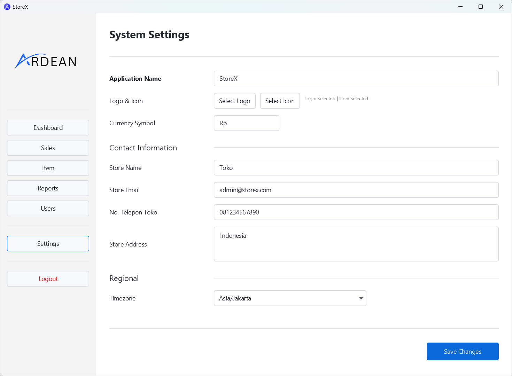

# StoreX POS


**A Robust JavaFX-Based Store Management System.**

StoreX POS is a professional desktop application engineered for rapid transaction processing, real-time inventory tracking, and a modern user experience. Built on the Java 21 LTS platform, it leverages a modular MVC architecture to ensure maintainability and high performance in local retail environments.

> Not gonna lie, you guys are mostly gonna use this project as your mid-terms homework cheat.

---

## 🚀 Features

- **Sales Management:**:
    - Add
    - Delete
    - Edit
    - Print
    - Scan from Barcode
- **Users Management:**
    - Add
    - Edit
    - Delete
    - Roles
- **Dashboard:**
    - Sales Overview
    - Analytics
- **Item Management:**
    - Add
    - Edit
    - Delete
    - Attribute = Name, Price, Category, Stock
- **Settings:**
    - Application Name Change
    - Logo & Icon Change
    - Currency Symbol
    - Store Name
    - Store Email
    - Store Phone
    - Store Address
    - Timezon
- **Reports/History:**
    - Track Transaction History
    - Sales Reports (Just Basic)
    - Edit Transaction
- **Professional UI Design:** Fully themed using the **AtlantaFX** library, providing a clean, modern, and accessible interface.

## StoreX Screenshot









## 🏗️ Architecture

The system follows a strict **Model-View-Controller (MVC)** pattern combined with the **Data Access Object (DAO)** pattern for clean separation of concerns:

* **View (JavaFX/FXML):** Declarative UI layer using FXML and CSS for professional styling.
* **Controller:** Orchestrates user interactions, input validation, and communication between the UI and the data layer.
* **Model (Java Records):** Lightweight, immutable data carriers used for Products, CartItems, and Sales.
* **DAO (Data Access):** Encapsulated SQL logic to manage all database interactions securely and efficiently.

---

## 🛠️ Technical Stack

* **Language:** Java 21 (LTS).
* **UI Engine:** JavaFX 21.
* **Styling:** AtlantaFX Design System.
* **Database:** MySQL 8.x (via JDBC).
* **Build Tool:** Apache Maven.

---

## 📥 Installation & Build

### Prerequisites

* **Windows 10/11** (Target OS).
* **JDK 21** installed and configured in the system PATH.
* **Maven 3.x** for dependency management.

### Setting Up the Environment

1. **Clone the Repository.**
2. **Database Configuration:** Ensure your local or remote MySQL instance is running and update the credentials in `DatabaseHelper.java`.
3. **Dependency Resolution:** Run `mvn clean install` to download all necessary libraries (AtlantaFX, MySQL Connector, Ikonli).

---

## 📦 Deployment (Portable EXE)

StoreX is designed to be distributed as a **Self-Contained Portable Application**.

### Step 1: Generate the Fat-JAR

Execute the Maven package command to "shade" all dependencies into a single executable JAR:

```bash
mvn clean package

```

*Note: Ensure the resulting JAR in `/target` is several megabytes in size, indicating all libraries are included.*

### Step 2: Build the Portable Image

Use `jpackage` to create a folder containing the EXE and a stripped-down Java Runtime (JRE):

```powershell
jpackage --type app-image `
  --dest dist `
  --name "StoreX-Portable" `
  --input target/ `
  --main-jar StoreX-1.0-SNAPSHOT.jar `
  --main-class com.ardean.pos.MainApp `
  --icon src/main/resources/icon.ico

```

---

## 🐞 Known Issues & Troubleshooting

* **Silent Crash on Launch:** Usually caused by a missing "Fat-JAR" configuration. If the EXE is only ~700KB, it does not contain the application code.
* **Type Mismatch Errors:** Ensure the `Product` model and `ProductController` use consistent types (String vs Integer) for category fields to avoid compilation failures.
* **JDBC Driver Not Found:** Ensure the MySQL connector is correctly defined in `pom.xml` and included in the shaded JAR.

---

## 📝 Summary

StoreX POS provides a professional-grade retail interface with zero-install portability. By combining Java 21's modern features with a dedicated local-first deployment strategy, it offers a reliable and fast solution for small to medium businesses.